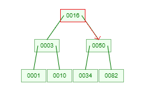
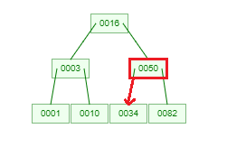
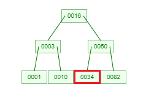

#### projet L3S6 sur les arbres B réalisé par ROUABAH Walid & Mohamed-Amine Fathallah

### Ce qui a été réalisé:
1) L'insertion d'une ou plusieurs clés
2) La recherche d'une clé
3) La documentation, avec sphinx.

### Ce qui n'a pas été réalisé ou réalisé partiellement:
-La suppression d'une ou plusieurs clés.  
-La fonction qui permet de savoir si l'arbre est un arbre b. Cette fonction aurait pu être utile dans le cas de notre projet, mais nous avons préféré vérifier graphiquement si l'arbre était un arbre b ou non.


## Sommaire :  
I) Fonctionnement du code et de la documentation
1) Comment créer un arbre
2) Comment ajouter une valeur
3) Comment chercher une valeur
4) Fonctionnement de la documentation
5) Ressources utilisées pour la réalisation de ce projet

II) Explication appronfondie du code et exemples sur la recherche et l'insertion
1) Pour la recherche
2) Pour l'insertion

## I) Fonctionnement général du code
Il est expliqué ici comment créer un arbre, puis lui insérer des valeurs et comment rechercher les valeurs.

1) ###  Comment créer un arbre :
Pour créer un arbre, il suffit de créer un objet de la classe Tree qui possède 2 paramètres obligatoires : 
- le nombre de fils minimal + 1 (L)
  - le nombre de fils maximal + 1 (U)

Par exemple, pour créer un arbre avec un fils minimal et 2 fils maximal on fera alors:  
`tree = Tree(2,3)`

2) ###  Comment ajouter une valeur :
On suppose ici qu'on a arbre nommé _tree_ qui existe déjà pour les exemples.
- Pour ajouter un seul élément à un arbre, il suffit de faire :  `tree.insert(key)`  
où key correspond à un nombre entier quelconque.


- Pour ajouter plusieurs valeurs à la fois, il suffit de faire :`tree.insert(l)`  
où l correspond à une liste quelconque contenant 0 ou plusieurs entiers.

3) ###  Pour chercher une valeur :
C'est tout simple, il suffit de taper : `tree.exists_key(key)`  
où key correspond correspond à la clé qu'on veut chercher dans l'arbre.

4) ### Fonctionnement et génération de la documentation 
La documentation sous format HTML a été générée grâce à Sphinx. 
Les fichiers html de la documentation sont contenus dans docs/_build/html.

5) ### Ressources utilisées pour la réalisation de ce projet
Nous avons utilisé plusieurs ressources pour nous aider de ce projet.  
Nous avons utilisé par exemple [programiz](https://www.programiz.com/dsa/b-tree), [btechsmartclass](http://www.btechsmartclass.com/data_structures/b-trees.html) et [Wikipedia](https://fr.wikipedia.org/wiki/Wikip%C3%A9dia:Accueil_principal).  
Il est bon à savoir que nous n'avons bien évidemment pas plagié ou copié le code issu de ces sites, bien que nous nous sommes inspirés, par exemple pour la recherche (surtout par la recherche dichotomique, car elle y ressemble pas mal).  
Nous avons également beaucoup utilisé le site https://www.cs.usfca.edu/~galles/visualization/BTree.html .  
**[OPTIONNEL]**  
Je me permets de donner les commandes même si la documentation a déjà été générée :  
1) _mkdir docs_ -> à la racine du projet, j'ai crée un dossier docs qui gère toute la documentation du projet.  
2) _cd docs_  -> car maintenant pour gérer la documentation tout se fait la dedans
3) _sphinx-quickstart_ -> pour initialiser sphinx dans le dossier docs
4) Quelques modifications au niveau du fichier docs/conf.py où j'ai décommenté la ligne 13 à 15,
et où j'ai ajouté une extension à la ligne 31 pour faire fonctionner la génération de l'HTML.
5) ajouté à la ligne 13 le mot *modules* du fichier docs/index.rst pour que tous les fichiers pythons du projet soient comptabilisés dans la doc HTML.
6) sphinx-apidoc.exe -o . .. -> pour générer la doc dans l'API sphinx (sans le ".exe" si le SE n'est pas Windows)
7) _make html_ pour générer le fichier html ou bien pour le mettre a jour dans docs/_build/html 


## II) Explication du code et exemples sur la recherche et l'insertion
On parlera ici de manière détaillée de toutes les situations différentes auquels on peut tomber quand on recherche une clé ou quand on ajouter une clé dans l'arbre,
en citant et en expliquant le code, avec des illustrations issues du site https://www.cs.usfca.edu/~galles/visualization/BTree.html.

1) ###  La fonction de recherche
Nous allons ici expliquer de manière détaillée le fonctionnement de la fonction de recherche exists_key() de la classe Node.  
D'abord, il est bon à savoir que la fonction search_keys() de la classe Tree appelle juste la fonction de la classe Node en utilisant le noeud racine de l'arbre en paramètre.  

Supposons donc qu'on a un arbre `tree = Tree(2,3)` dans lequel est déjà inséré des valeurs et qu'on cherche la valeur 34.  
Au tout début de l'itération nous sommes au noeud racine de l'arbre, correspondant à la valeur 16.  

Une remarque à ajouter avant de commencer : peu importe le nombre de fils minimum et maximum, le résultat de cet exemple reviendrait au même.
#### Etape 1
<table>
<tr>
<td>

</td>
<td>

``` Python
        i = 0
        # pour la première itération, i < 1 et 34 > 16 donc i += 1
        # il n'y aura pas de deuxieme itération car i sera égal à la taille des clés du noeud. (donc 1)
        while i < len(self.keys) and searching_key > self.keys[i]:
            i += 1
            
        #donc i = 1
        
        # le noeud n'est pas un leaf donc on passe ce bloc
        if self.leaf: 
            return i < len(self.keys) and searching_key == self.keys[i]
            
        # on applique donc la condition ci dessous
        else:
            # i == self.keys == 1 donc on applique ce code
            if i == len(self.keys):
                # vu que 34 est supérieur à 16 on va à la partie de droite et on 
                # applique la fonction de maniere recursive au noeud enfant
                # on peut maintenant passer à l'etape 2.
                self.childrens[-1].exists_key(searching_key)

            # cette partie est donc ignorée
            elif self.keys[i] == searching_key:
                return True
            # de même pour cette partie
            return self.childrens[i].exists_key(searching_key)
}
````

</td>
</tr>
</table>

#### Etape 2
<table>
<tr>
<td>

</td>
<td>

``` Python
        i = 0
        # cette fois ci i restera a 0 car 34 < 50.
        while i < len(self.keys) and searching_key > self.keys[i]:
            i += 1
            
        # donc i = 0
        
        # le noeud n'est pas un leaf donc on passe ce bloc
        if self.leaf: 
            return i < len(self.keys) and searching_key == self.keys[i]
            
        # on applique donc l'autre condition ci dessous
        else:
            # i = 0 et la taille des clés égale à 1 donc on ignore ce bloc
            if i == len(self.keys):
                self.childrens[-1].exists_key(searching_key)

            # self.keys[i] (==50) n'est pas égal à searching_key (== 34) donc on ignore
            elif self.keys[i] == searching_key:
                return True
            # on applique donc de manière recursive le code,
            # cette fois ci a la partie gauche car clé recherchée inférieure de 50
            return self.childrens[i].exists_key(searching_key)
}
````

</td>
</tr>
</table>

#### Etape 3
<table>
<tr>
<td>

</td>
<td>

``` Python
        i = 0
        # cette fois ci i restera a 0 car 34 == 34.
        while i < len(self.keys) and searching_key > self.keys[i]:
            i += 1
            
        # donc i = 0
        
        # le noeud est un leaf donc on applique ce bloc :
        if self.leaf: 
            # on retourne cette condition, et self.keys[i] (== 34) est bien égale à la clé qu'on recherche
            # donc la clé a été retrouvée : on retourne True.
            return i < len(self.keys) and searching_key == self.keys[i]
            
        else:
            if i == len(self.keys):
                self.childrens[-1].exists_key(searching_key)

            elif self.keys[i] == searching_key:
                return True
            return self.childrens[i].exists_key(searching_key)
}
````

</td>
</tr>
</table>

Bien que selon le nombre qu'on cherche l'ordre des blocs peut être différent, nous avons appliqué dans cet exemple l'usage de tous les blocs dans toutes les situations.  
Il est bon à savoir que la fonction est de compléxité O(log n), comme demandé dans les consignes du projet.


2) ###  L'insertion
Pour l'insertion, 4 méthodes ont été réalisées et utilisées. Nous allons commencer par expliquer la méthode insert() de la classe Node.

#### Etape 1
<table>
<tr>
<td>

</td>
<td>

``` Python
        # i correspond à l'endroit où doit être inséré par rapport au clés déjà existentes :
        # en effet, un tableau de clé est toujours ordonné de la plus petite valeur à la plus grande
        
        i = self.keyIndex(key)
        if not self.leaf:
            print("on va au fils contenant les clés", self.childrens[i].keys)
            bool = self.childrens[i].insert(key, tree)
            if bool:
                tree.split(self.childrens[i])
                return len(self.keys) > tree.nbChildMax
            else:
                return False
        else:
            print("ajout de", key, "au noeud contenant déjà les clés", self.keys)
            self.keys.insert(i, key)
            return len(self.keys) > tree.nbChildMax

}
````

</td>
</tr>
</table>